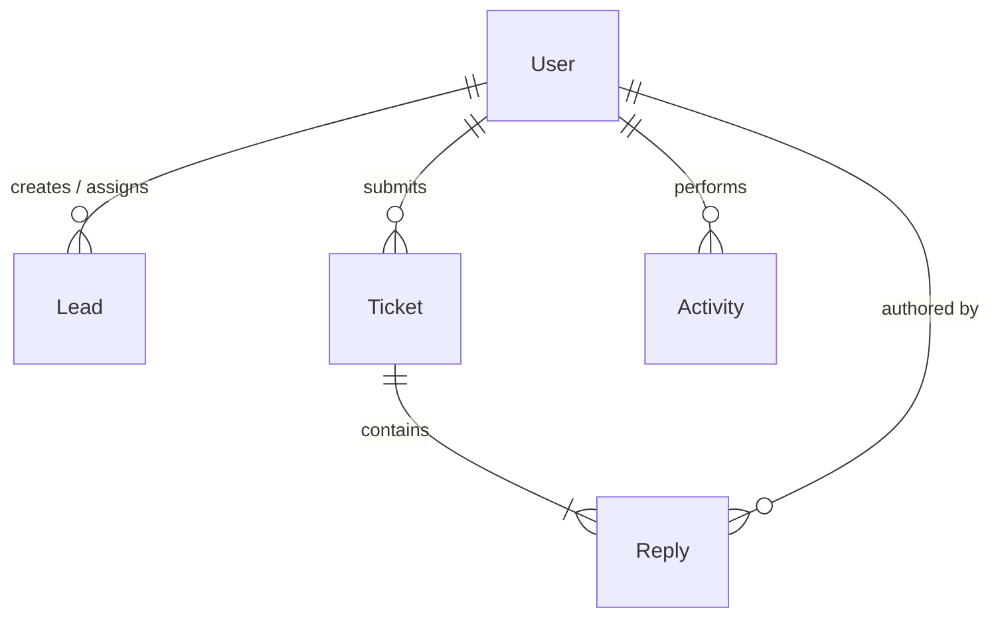

# 🛡️ AffiliateCRM — Enterprise MERN + Gemini AI Platform

<p align="center">
  <a href="https://github.com/YASHASVI0422/AffiliateCRM">
    
  </a>
  <a href="https://github.com/YASHASVI0422/AffiliateCRM/blob/main/LICENSE">
    
  </a>
  <a href="https://github.com/YASHASVI0422/AffiliateCRM/actions">
    
  </a>
  <a href="https://nodejs.org">
    
  </a>
  <a href="https://mongodb.com">
    
  </a>
</p>

<p align="center">
  <strong>An intelligent, high-performance affiliate management platform unifying the MERN stack with Google Gemini AI and WebSockets.</strong>
</p>

---

## 📌 Table of Contents

1. [🔮 Features Overview](#-features-overview)
2. [📂 Project Architecture](#-project-architecture)
3. [📊 Database Schema & Index Design](#-database-schema--index-design)
4. [🔌 Core API Endpoint Reference](#-core-api-endpoint-reference)
5. [🛠️ Installation & Local Development](#%EF%B8%8F-installation--local-development)
6. [🧪 Test Execution](#-test-execution)
7. [☁️ Production Deployment](#-production-deployment)
8. [📄 License](#-license)

---

## 🔮 Features Overview

### 🎨 Premium UI/UX Experience
* **Floating Glassmorphic Interface**: Gorgeous, centered log-in and registration pages utilizing frosted glass panels, ambient colored gradient orbs, and a futuristic dark blueprint pattern.
* **Glow Metrics Dashboard**: Live database diagnostic indicators (`Active Real-time`, `99.9% Uptime SLA`, `Gemini AI-Powered`) featuring dynamic color-cycling on cursor hover.
* **Smart UI Hooks**: Real-time notifications displaying background processes such as `"Gemini is analysing..."` to integrate AI features naturally.

### 💬 Live Support Ticketing & Chat Upgrades
* **Multi-Source Attachments**: Support for uploading and sharing screenshot attachment files directly inside support rooms.
* **Clipboard Screenshot Injection**: Integrates a custom clipboard listener (`onPaste`) allowing users to copy any image and paste it directly into the chat input.
* **Alternating Discussion Threads**: A styled dialogue interface aligning Admin replies on the right and Affiliate replies on the left, complete with user avatars, admin badges, and expand-on-click image lightboxes.
* **WebSockets Sync Engine**: Powered by Socket.io to deliver instant, real-time message updates (`ticket_reply_received`) and status updates.

### 🔐 Security & Reliability
* **Logout Token Blacklisting**: A dedicated, automated TTL collection in MongoDB that blacklists and invalidates JWT tokens immediately upon user logout.
* **Nano ID Keys**: Generates cryptographically secure identifiers (`TKT-<NANOID>`) to replace generic sequential database IDs.
* **CSV Audit Export**: Features built-in data compilation utilities to download structured CSV reports of leads.

---

## 📂 Project Architecture

```
AffiliateCRM
├── backend/
│   ├── __tests__/            # Jest Integration Testing suite (Auth, Leads)
│   ├── src/
│   │   ├── config/           # Database connecting & Socket.io server configurations
│   │   ├── controllers/      # Routing Controllers (AI, Analytics, Auth, Leads, Tickets)
│   │   ├── middleware/       # Custom middlewares (JWT parsing, blacklist checking)
│   │   ├── models/           # Mongoose Database schemas (User, Lead, Ticket, Activity)
│   │   ├── routes/           # Express router files
│   │   └── utils/            # DB seeder & helper utilities
│   ├── server.js             # Express API entrypoint & Socket.io initialization
│   └── test-setup.js         # In-memory MongoDB testing setup helper
├── frontend/
│   ├── src/
│   │   ├── api/              # Axios client configuration & API call hooks
│   │   ├── assets/           # Static media assets and icon templates
│   │   ├── components/       # Reusable layout and custom UI components
│   │   ├── context/          # React contexts (Socket, Auth, Toaster notification)
│   │   ├── pages/            # View pages (Auth, Leads, Dashboard, Tickets)
│   │   ├── App.jsx           # App layout router shell
│   │   ├── index.css         # Tailwind & custom CSS variables configuration
│   │   └── main.jsx          # React app entrypoint
│   ├── index.html            # Vite template index file
│   ├── tailwind.config.js    # Custom styling overrides
│   └── vite.config.js        # Vite server & local dev proxy configurations
├── netlify.toml              # Netlify monorepo deployment config
└── LICENSE                   # MIT Open Source License
```

---

## 📊 Database Schema & Index Design



### 👤 1. `User` Schema
Stores account credentials, profile details, and affiliate attributes.
| Field | Type | Attributes | Description |
| :--- | :--- | :--- | :--- |
| `name` | String | `required, trim: true` | Full user name |
| `email` | String | `required, unique, lowercase` | Email credentials |
| `password` | String | `required, min: 6, select: false` | Bcrypt hashed string |
| `role` | String | `enum: ['admin', 'affiliate'], default: 'affiliate'` | Access level status |
| `phone` / `bio` | String | — | Optional bio details |
| `avatar` | String | `default: ""` | Optional profile image link |
| `isActive` | Boolean | `default: true` | Active account toggle |
| `affiliateCode` | String | `unique, sparse` | Unique identifier (e.g. `AFF-XXXXXXXX`) |
| `lastLogin` | Date | — | Timestamp of last login |

### 📈 2. `Lead` Schema
Contains information on potential prospects, tracked value, and assigned affiliates.
| Field | Type | Attributes | Description |
| :--- | :--- | :--- | :--- |
| `name` | String | `required, trim: true` | Lead full name |
| `email` | String | `required, lowercase` | Lead email |
| `phone` / `company` | String | — | Lead contact details |
| `source` | String | `enum: ['Website', ..., 'Other'], default: 'Other'` | Attribution source |
| `status` | String | `enum: ['New Lead', ..., 'Converted'], default: 'New Lead'` | Pipeline status |
| `assignedAffiliate` | ObjectId | `ref: 'User'` | Assigned affiliate manager |
| `value` | Number | `default: 0` | Forecasted revenue value |
| `createdBy` | ObjectId | `ref: 'User', required` | User who created the lead |
| `convertedAt` | Date | — | Timestamp of conversion |
* **Indexes**: 
  * `{ name: 'text', email: 'text', company: 'text' }` for high-performance searches.
  * `{ assignedAffiliate: 1, status: 1, createdAt: -1 }` (Compound index).
  * `{ createdBy: 1, createdAt: -1 }` (Index).

### 🎫 3. `Ticket` Schema
Support requests containing threaded conversation replies.
| Field | Type | Attributes | Description |
| :--- | :--- | :--- | :--- |
| `ticketId` | String | `unique` | Auto-generated secure custom id: `TKT-<NANOID>` |
| `subject` | String | `required, trim` | Summary heading |
| `description` | String | `required` | Details of the request |
| `screenshot` | String | — | Screenshot attachment base64 / URL |
| `status` | String | `enum: ['Open', 'In Progress', 'Resolved', 'Closed'], default: 'Open'` | Support status |
| `priority` | String | `enum: ['Low', 'Medium', 'High'], default: 'Medium'` | Severity rank |
| `category` | String | `enum: ['Technical', 'Billing', 'General', 'Bug Report', 'Feature Request'], default: 'General'` | Issue context |
| `user` | ObjectId | `ref: 'User', required` | Submitting affiliate |
| `assignedTo` | ObjectId | `ref: 'User'` | Admin responder |
| `replies` | Array | `[ReplySchema]` | Embedded message thread |
* **`ReplySchema` Sub-document fields**: `message` (String, required), `author` (ObjectId, ref: 'User', required), `isAdmin` (Boolean, default: false), `screenshot` (String).
* **Indexes**: `{ user: 1, status: 1, createdAt: -1 }` (Compound index).

### 📜 4. `Activity` Schema (Audit Logs)
An immutable ledger tracking user operations and CRM transactions.
| Field | Type | Attributes | Description |
| :--- | :--- | :--- | :--- |
| `user` | ObjectId | `ref: 'User', required` | Action performer |
| `type` | String | `enum: ['lead_created', ..., 'user_registered'], required` | Event type classification |
| `description` | String | `required` | Details of operation |
| `metadata` | Mixed | `default: {}` | Extensible key-value metadata |
| `entityId` | ObjectId | — | Target document identifier |
| `entityType` | String | `enum: ['Lead', 'Ticket', 'User']` | Target collection classification |
* **Indexes**: `{ user: 1, createdAt: -1 }` (Compound index).

### 🚫 5. `TokenBlacklist` Schema (Session Purge)
Maintains logged-out authorization tokens.
| Field | Type | Attributes | Description |
| :--- | :--- | :--- | :--- |
| `token` | String | `required, unique` | Invalidated JWT string |
| `createdAt` | Date | `default: Date.now, expires: 604800` | Automated 7-day TTL expiration index |

---

## 🔌 Core API Endpoint Reference

| Method | Endpoint | Auth | Role | Description |
| :--- | :--- | :---: | :---: | :--- |
| `POST` | `/api/auth/register` | 🔓 | Public | Register a new user |
| `POST` | `/api/auth/login` | 🔓 | Public | User login, returns JWT token |
| `POST` | `/api/auth/logout` | 🔐 | Any | Logout, blacklists token |
| `GET` | `/api/auth/me` | 🔐 | Any | Retrieve active user profile |
| `GET` | `/api/leads` | 🔐 | Any | List all assigned leads |
| `POST` | `/api/leads` | 🔐 | Any | Add a new lead to the pipeline |
| `GET` | `/api/leads/export` | 🔐 | Admin | Download lead logs as a CSV file |
| `POST` | `/api/tickets` | 🔐 | Any | Submit a support ticket |
| `GET` | `/api/tickets/:id` | 🔐 | Any | View ticket chat thread |
| `POST` | `/api/tickets/:id/replies` | 🔐 | Any | Send a reply inside chat |
| `POST` | `/api/ai/analyze-dashboard` | 🔐 | Any | Generate dashboard insights with Gemini |

---

## 🛠️ Installation & Local Development

### 1. Database Connection
Ensure you have MongoDB running locally (e.g., connect MongoDB Compass to `mongodb://localhost:27017`).

### 2. Backend Config
```bash
cd backend
npm install
```
Create a `backend/.env` file:
```env
PORT=5000
MONGODB_URI=mongodb://localhost:27017/affiliate-crm
JWT_SECRET=your_jwt_signing_key_here
JWT_EXPIRES_IN=7d
NODE_ENV=development
FRONTEND_URL=http://localhost:5173
GEMINI_API_KEY=AIzaYour_Free_Gemini_Key_Here
```
*Seed default users and mock leads:*
```bash
node src/utils/seed.js
```
*Run API server in hot-reload mode:*
```bash
npm run dev
```

### 3. Frontend Config
```bash
cd ../frontend
npm install
```
Create a `frontend/.env` file:
```env
VITE_API_URL=http://localhost:5000/api
```
*Run Vite React application:*
```bash
npm run dev
```

---

## 🧪 Test Execution

Verify all endpoints, validators, security settings, and controllers with our preconfigured suite using Jest, Supertest, and a mock in-memory database:
```bash
cd backend
npm run test
```

---

## ☁️ Production Deployment

For complete, step-by-step instructions on deploying the frontend to **Netlify**, the backend API server to **Render**, and the database to **MongoDB Atlas**, please consult the local **[Production Deployment Guide](DEPLOYMENT.md)**.

---

## 📄 License
This project is open-source and available under the terms of the [MIT License](LICENSE).
