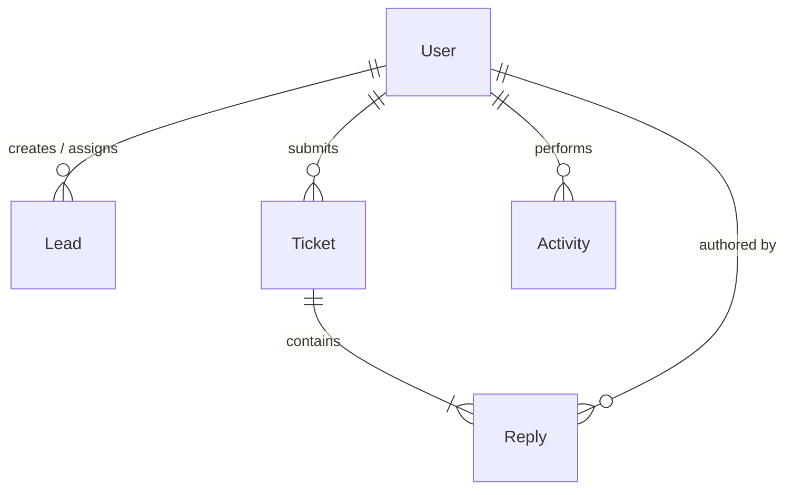

# AffiliateCRM — Enterprise-Grade MERN + Gemini AI CRM Platform

AffiliateCRM is a highly optimized, modern MERN (MongoDB, Express, React, Node.js) Customer Relationship Management platform powered by Gemini AI. It provides business intelligence insights, real-time ticket troubleshooting, secure CSV auditing, token-based session invalidation, and custom support chat modules.

---

## 🛠️ Tech Stack & Tooling

### Frontend
* **Core Framework**: React 18 with Vite (fast hot-reloading dev server)
* **State Management**: TanStack Query (React Query) for robust caching and server-state synchronization
* **Real-time Comms**: Socket.io Client for immediate bidirectional notifications
* **Styling**: TailwindCSS with CSS custom variables for a responsive, clean, and interactive user interface

### Backend
* **Runtime & Framework**: Node.js & Express.js
* **Database Driver**: Mongoose (MongoDB object modeling)
* **Real-time Server**: Socket.io Server for user-specific notification rooms
* **AI Engine**: Google Gen AI SDK utilizing the free Gemini API
* **Security & Tokens**: JWT (JSON Web Tokens), Bcrypt.js (password hashing), and `nanoid` (cryptographically secure identifier generation)

### Testing Suite
* **Testing Framework**: Jest
* **Integration Driver**: Supertest
* **In-Memory Server**: `mongodb-memory-server` to run mock database environments in isolation with 100% data safety

---

## 🚀 Key Features

### 💻 Modern Visual Experience
* **Floating Glassmorphic Authentication**: Centered glassmorphic login and register cards over dynamic animated neon gradient backdrops and a high-tech vector grid.
* **Premium Dashboard Analytics**: Real-time stats widgets (`Active Real-time`, `99.9% Uptime SLA`, `Gemini AI-Powered`) styled with custom color palettes and interactive hover responses.
* **Gemini AI Integration**: Replaced legacy system messages with "Gemini AI" and "Gemini is analyzing..." notifications for active user queries.

### 💬 Support Ticketing & Live Chat
* **Screenshot & File Uploads**: Support for direct image attachment uploads from files.
* **Clipboard Paste Injection**: Clipboard paste listener (`onPaste`) allowing users to paste screenshots directly from their clipboard into support chat input.
* **Alternating Message Bubbles**: Dynamic user vs. admin message styling, side-by-aligned avatars, status badges, and expandable inline lightbox previews.
* **Socket.io Notifications**: Instant live messaging updates (`ticket_reply_received`) and background notification triggers on status alterations.

### 🛡️ Enterprise Security & Integrity
* **JWT Token Blacklisting**: Storing invalid user tokens in MongoDB on logout to enforce strict session invalidations.
* **Auto-generated Nano IDs**: Custom `TKT-<NANOID>` unique keys for all support tickets.
* **CSV Export**: Secure auditing tools for administrators to generate and download CSV reports of leads.
* **Sanitized Secrets Configuration**: Clear separation of development environment settings without tracking secret API keys.

---

## 📊 Database Design & Schema Architecture

The application uses MongoDB (via Mongoose) to represent data. Below is the relationship map and detailed schema designs for the 5 key collections.



### 1. `User` Collection (Authentication & Profiles)
Stores users (admins and affiliates) with encrypted credentials and profile fields.
* **Schema Fields:**
  * `_id` (`ObjectId`): Unique MongoDB identifier.
  * `name` (`String`, required, trimmed): Full name.
  * `email` (`String`, required, unique, lowercase): User email address.
  * `password` (`String`, required, minimum length 6, excluded by default): Bcrypt-hashed password.
  * `role` (`String`, enum: `['admin', 'affiliate']`, default: `'affiliate'`): User role.
  * `phone` (`String`): Phone number.
  * `bio` (`String`): Short bio description.
  * `avatar` (`String`, default: `""`): Image URL for user avatar.
  * `isActive` (`Boolean`, default: `true`): Active status toggle.
  * `affiliateCode` (`String`, unique, sparse): Auto-generated affiliate code (e.g., `AFF-XXXXXXXX`) created on initialization.
  * `lastLogin` (`Date`): Timestamp of the last successful login.
  * `createdAt` / `updatedAt` (`Date`): Auto-managed timestamps.

### 2. `Lead` Collection (Contact Pipeline)
Contains information on potential prospects, tracked value, and assigned affiliates.
* **Schema Fields:**
  * `_id` (`ObjectId`): Unique identifier.
  * `name` (`String`, required, trimmed): Contact name.
  * `email` (`String`, required, lowercase): Contact email.
  * `phone` (`String`): Contact phone number.
  * `company` (`String`): Associated organization.
  * `source` (`String`, enum: `['Website', 'Referral', 'Social Media', 'Email Campaign', 'Cold Call', 'Event', 'Other']`): Source channel.
  * `status` (`String`, enum: `['New Lead', 'Contacted', 'Interested', 'Joined Community', 'Converted']`): CRM status.
  * `assignedAffiliate` (`ObjectId`, ref: `User`): Link to the affiliate manager.
  * `notes` (`String`): Interaction logs.
  * `value` (`Number`, default: `0`): Target lead valuation.
  * `createdBy` (`ObjectId`, ref: `User`, required): The creator of this lead.
  * `convertedAt` (`Date`): Timestamp of lead conversion.
  * `followUpDate` (`Date`): Next scheduled interaction.
  * `followUpNote` (`String`): Context for the next follow-up.
* **Database Indexes:**
  * Text Index: `{ name: 'text', email: 'text', company: 'text' }` for high-performance searches.
  * Compound Index: `{ assignedAffiliate: 1, status: 1, createdAt: -1 }` for affiliate dashboard queries.
  * Index: `{ createdBy: 1, createdAt: -1 }` for author search filters.

### 3. `Ticket` Collection (Support Tickets & Embedded Chat Replies)
Handles queries, ticket priorities, attachments, and embedded discussion boards.
* **Schema Fields:**
  * `_id` (`ObjectId`): Unique identifier.
  * `ticketId` (`String`, unique): Generated identifier `TKT-<NANOID>` (using nanoid).
  * `subject` (`String`, required, trimmed): Ticket topic.
  * `description` (`String`, required): Full description.
  * `screenshot` (`String`): Base64 encoded or direct URL to the screenshot attachment.
  * `status` (`String`, enum: `['Open', 'In Progress', 'Resolved', 'Closed']`, default: `'Open'`): Current state.
  * `priority` (`String`, enum: `['Low', 'Medium', 'High']`, default: `'Medium'`): Severity level.
  * `category` (`String`, enum: `['Technical', 'Billing', 'General', 'Feature Request', 'Bug Report']`): Ticket category.
  * `user` (`ObjectId`, ref: `User`, required): Submitting user.
  * `assignedTo` (`ObjectId`, ref: `User`): Handling admin.
  * `replies` (`Array`): Thread containing sub-documents representing messages.
    * **`Reply` Sub-Schema:**
      * `message` (`String`, required): Message text.
      * `author` (`ObjectId`, ref: `User`, required): Author of this message.
      * `isAdmin` (`Boolean`, default: `false`): Admin role flag.
      * `screenshot` (`String`): Paste-in or upload screenshot image.
      * `createdAt` / `updatedAt` (`Date`): Timestamps.
  * `resolvedAt` (`Date`): Timestamp when marked as resolved.
  * `closedAt` (`Date`): Timestamp when closed.
* **Database Indexes:**
  * Compound Index: `{ user: 1, status: 1, createdAt: -1 }` for user support panels.

### 4. `Activity` Collection (Audit Logs)
Audit log system tracking database operations, status updates, and user triggers.
* **Schema Fields:**
  * `user` (`ObjectId`, ref: `User`, required): User who triggered the event.
  * `type` (`String`, enum: `['lead_created', 'lead_updated', 'lead_converted', 'ticket_created', 'ticket_updated', 'ticket_replied', 'user_login', 'user_registered']`): Event category.
  * `description` (`String`, required): Human-readable event log description.
  * `metadata` (`Mixed`, default: `{}`): Extensible key-value storage.
  * `entityId` (`ObjectId`): The target item's database ID.
  * `entityType` (`String`, enum: `['Lead', 'Ticket', 'User']`): Document type.
* **Database Indexes:**
  * Compound Index: `{ user: 1, createdAt: -1 }` for audit lists.

### 5. `TokenBlacklist` Collection (Session Expiry)
Stores logged-out JWT tokens to ensure absolute API invalidation.
* **Schema Fields:**
  * `token` (`String`, required, unique): Expired JSON Web Token.
  * `createdAt` (`Date`, expires in 7 days): Automatic TTL index to auto-delete entries after token expiration time.

---

## 🛠️ Installation & Local Development

### 1. Database Connection
Launch MongoDB locally (e.g., connect MongoDB Compass to `mongodb://localhost:27017`).

### 2. Backend Config
```bash
cd backend
npm install
```
Create a `backend/.env` file:
```env
PORT=5000
MONGODB_URI=mongodb://localhost:27017/affiliate-crm
JWT_SECRET=your_jwt_signing_key_here
JWT_EXPIRES_IN=7d
NODE_ENV=development
FRONTEND_URL=http://localhost:5173
GEMINI_API_KEY=AIzaYour_Free_Gemini_Key_Here
```
*Seed data & launch server:*
```bash
node src/utils/seed.js
npm run dev
```

### 3. Frontend Config
```bash
cd ../frontend
npm install
```
Create a `frontend/.env` file:
```env
VITE_API_URL=http://localhost:5000/api
```
*Launch Dev Server:*
```bash
npm run dev
```

### 4. Run Verification Tests
Verify code status and API endpoints using the automated testing suite:
```bash
cd ../backend
npm run test
```

---

## 📄 License
This project is open-source and available under the terms of the [MIT License](LICENSE).
