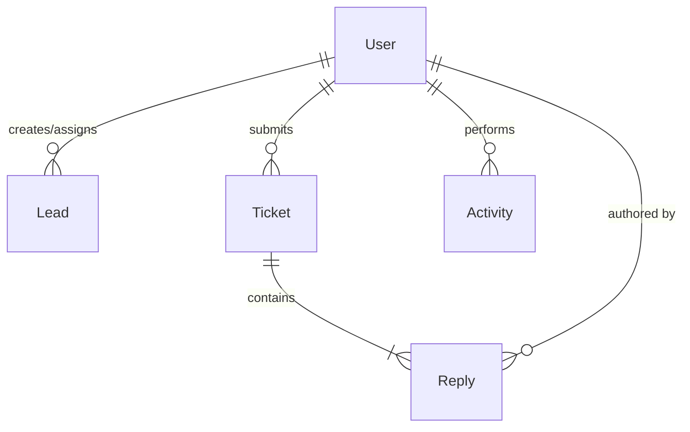

# 🛡️ AffiliateCRM — Enterprise MERN + Gemini AI Platform

<p align="center">
  
  
  
  
</p>
<p align="center">
  
  
  
  
</p>

### 🌐 Overview
**AffiliateCRM** is an intelligent, high-performance affiliate management platform unifying a modern MERN stack with Google Gemini AI analysis and real-time WebSockets synchronization. Designed with rich glassmorphic aesthetics, advanced security protocols, and real-time chat, it delivers a premium and robust enterprise experience.

**🔗 Live Demo**: [https://affiliatecrm.netlify.app/](https://affiliatecrm.netlify.app/)

<p align="center">
  <a href="https://affiliatecrm.netlify.app/">
    
  </a>
</p>

---

## 🚀 Key Features

* **🧠 Gemini AI Analytics**: One-click, intelligent dashboard analysis extracting key performance insights, trend identification, and automatic recommendations.
* **⚡ Real-Time WebSockets Engine**: Instant support chat updates (`ticket_reply_received`) and live system notifications powered by Socket.io.
* **🔒 Professional Session Security**:
  * **Auto-Logout**: Inactivity detection logs users out automatically after 1 hour of idle time (synced across tabs via `localStorage` state tracking).
  * **Token Blacklisting**: Automated TTL (Time-To-Live) collection in MongoDB that instantly invalidates JWTs upon manual or automatic logout.
* **🎨 Premium UI/UX Experience**: Frosted glassmorphic panels, ambient gradient backgrounds, glow metric indicators with dynamic cursor hover states, and smooth CSS micro-interactions.
* **💬 Rich Ticketing Support**: Support thread replies, screenshot file uploads, paste-from-clipboard screenshot upload listeners (`onPaste`), and interactive image lightboxes.
* **📊 Text Search & Pipeline Tools**: Fast full-text search index for leads and tickets, drag-and-drop-ready pipelines, and structured CSV lead export.

---

## 📂 System Architecture

```
AffiliateCRM
├── backend/
│   ├── __tests__/            # Jest integration tests (Auth, Leads)
│   ├── src/
│   │   ├── config/           # DB, Middleware, and WebSockets configurations
│   │   ├── controllers/      # Route logic handlers (AI, Auth, Leads, Tickets)
│   │   ├── middleware/       # JWT parsing, auth, and blacklist verification
│   │   ├── models/           # Mongoose schemas (User, Lead, Ticket, Activity)
│   │   ├── routes/           # Express router configuration
│   │   └── utils/            # DB seeders and general utility helpers
│   ├── server.js             # Express & Socket.io server entrypoint
│   └── test-setup.js         # In-memory MongoDB testing setup
└── frontend/
    ├── src/
    │   ├── api/              # Axios instance configuration & API hooks
    │   ├── components/       # Layout structures & custom reusable components
    │   ├── context/          # React Auth, Socket, and Notification contexts
    │   ├── pages/            # View pages (Dashboard, Leads, Tickets, Settings)
    │   ├── App.jsx           # Client router shell
    │   └── index.css         # Styling system configuration
    ├── vite.config.js        # Vite build tool and local dev proxy config
    └── tailwind.config.js    # Custom Tailwind CSS configurations
```

---

## 📊 Database Schema Design



### 🗄️ Core Models

1. **`User`**: Manages login credentials, role classifications (`admin`, `affiliate`), phone numbers, and unique affiliate codes.
2. **`Lead`**: Pipeline information mapping source attribution, financial values, statuses (`New Lead` ➜ `Converted`), and assignments.
3. **`Ticket`**: Support requests with high-performance compound indexing, priorities, categories, and embedded message replies.
4. **`Activity`**: Audit trail record tracking all user events.
5. **`TokenBlacklist`**: Invalidated auth tokens expiring automatically via 7-day TTL index rules.

---

## 🔌 API Endpoint Reference

| Method | Endpoint | Access | Description |
| :--- | :--- | :---: | :--- |
| `POST` | `/api/auth/register` | 🔓 Public | Registers a new team user |
| `POST` | `/api/auth/login` | 🔓 Public | Performs credentials login, returns JWT |
| `POST` | `/api/auth/logout` | 🔐 Auth | Invalidates session and blacklists token |
| `GET` | `/api/auth/me` | 🔐 Auth | Returns current verified user payload |
| `GET` | `/api/leads` | 🔐 Auth | Retrieves list of assigned pipeline leads |
| `POST` | `/api/leads` | 🔐 Auth | Creates a new pipeline lead |
| `GET` | `/api/leads/export` | 👑 Admin | Downloads full pipeline log as CSV |
| `POST` | `/api/tickets` | 🔐 Auth | Opens a new support ticket query |
| `GET` | `/api/tickets/:id` | 🔐 Auth | Fetches individual ticket discussion thread |
| `POST` | `/api/tickets/:id/replies` | 🔐 Auth | Appends a reply to a support thread |
| `POST` | `/api/ai/analyze-dashboard` | 🔐 Auth | Generates dashboard insights with Gemini |

---

## 🛠️ Installation & Local Setup

### ⚙️ Prerequisites
Ensure you have **Node.js (v18+)** installed and a local instance of **MongoDB** running (e.g. `mongodb://localhost:27017`).

### 📦 1. Backend Setup
1. Navigate to the backend directory and install dependencies:
   ```bash
   cd backend
   npm install
   ```
2. Create a `.env` file in the `backend/` directory:
   ```env
   PORT=5000
   MONGODB_URI=mongodb://localhost:27017/affiliate-crm
   JWT_SECRET=your_jwt_signing_key_here
   JWT_EXPIRES_IN=7d
   NODE_ENV=development
   FRONTEND_URL=http://localhost:5173
   GEMINI_API_KEY=AIzaYour_Free_Gemini_Key_Here
   ```
3. Populate database with dummy records:
   ```bash
   npm run seed
   ```
4. Start the backend developer API server:
   ```bash
   npm run dev
   ```

### 💻 2. Frontend Setup
1. Navigate to the frontend directory and install dependencies:
   ```bash
   cd ../frontend
   npm install
   ```
2. Create a `.env` file in the `frontend/` directory:
   ```env
   VITE_API_URL=http://localhost:5000/api
   ```
3. Boot the local Vite development web server:
   ```bash
   npm run dev
   ```
4. Open your browser and navigate to `http://localhost:5173`.

---

## 🧪 Test Execution
The platform includes integration suites verifying validators, authorization gates, and handlers using Jest, Supertest, and a virtual in-memory MongoDB environment.
Run tests from the `backend/` folder:
```bash
npm run test
```

---

## 📄 License
This project is open-source and released under the [MIT License](LICENSE).
