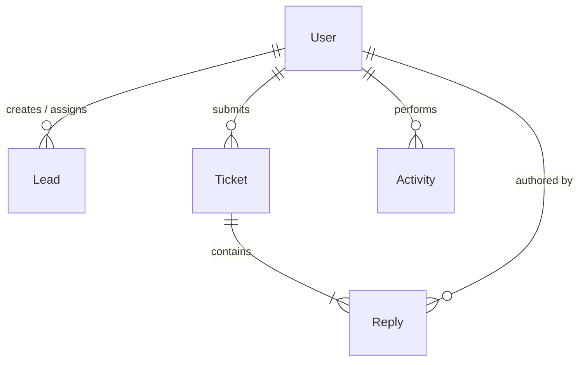

# 🛡️ AffiliateCRM — Enterprise-Grade MERN + Gemini AI Platform

<p align="center">
  
  
  
  
  <br>
  
  
  
  
</p>

---

## 🌟 Overview

**AffiliateCRM** is an intelligent, high-performance affiliate management platform. By uniting the MERN stack with **Google's Gemini AI** and **Socket.io web-sockets**, it enables real-time ticket escalation, visual media sharing, automated lead scoring, and structured CSV logs in an elegant, responsive interface.

---

## ⚡ Key Highlights & Features

### 🎨 Premium UI/UX Experience
* 🔮 **Floating Glassmorphic Cards**: Beautiful, centered login and sign-up panels sitting over animated fluid backdrop spheres and a dark blueprint grid.
* 📊 **Dynamic Widgets**: Glow indicators representing database status (`Active Real-time`, `99.9% Uptime SLA`, `Gemini AI-Powered`) with active color-cycling hover states.
* 🤖 **Smart Prompts**: Native notifications showing active text processing like `"Gemini is analysing..."` to make AI operations feel integrated.

### 💬 Live Support Ticketing & Chat Upgrades
* 📎 **Multi-source Attachments**: Support for uploading and sharing screenshot attachment files directly inside support rooms.
* 📋 **Direct Clipboard Paste**: A custom listener (`onPaste`) allowing users to copy any image to their clipboard and paste it directly into the chat input.
* 💬 **Alternating Chat Bubbles**: A sleek dialogue box with custom alignment (Admin replies on the right, Affiliate replies on the left), avatars, status badges, and an expand-on-click lightbox.
* ⚡ **WebSockets System**: Socket.io-driven connection pools delivering instant message delivery and status alerts.

### 🔐 Security & Reliability
* 🚫 **JWT Token Blacklist**: Expiration-aware MongoDB-based blacklist collections invalidating user tokens upon logout.
* 🆔 **Nano ID Key Generation**: Unique cryptographically secure identifiers (`TKT-<NANOID>`) replacing simple sequential database IDs.
* 🗃️ **CSV Audit Logs**: Instant Excel/CSV data exports for administrators to monitor conversion tracking.

---

## 📊 Database Schema & Architecture

The application uses MongoDB (via Mongoose) to represent data. Below is the relationship map and detailed schema designs for the 5 key collections.



### 👤 1. `User` Collection (Authentication & Profiles)
Stores users (admins and affiliates) with encrypted credentials and profile fields.
* **Schema Fields:**
  * 🔑 `_id` (`ObjectId`): Unique MongoDB identifier.
  * 🏷️ `name` (`String`, required, trimmed): Full name.
  * 📧 `email` (`String`, required, unique, lowercase): User email address.
  * 🔒 `password` (`String`, required, minimum length 6, excluded by default): Bcrypt-hashed password.
  * 👥 `role` (`String`, enum: `['admin', 'affiliate']`, default: `'affiliate'`): User role.
  * 📞 `phone` (`String`): Phone number.
  * 📝 `bio` (`String`): Short bio description.
  * 🖼️ `avatar` (`String`, default: `""`): Image URL for user avatar.
  * ⚡ `isActive` (`Boolean`, default: `true`): Active status toggle.
  * 🎫 `affiliateCode` (`String`, unique, sparse): Auto-generated affiliate code (e.g., `AFF-XXXXXXXX`) created on initialization.
  * 🕒 `lastLogin` (`Date`): Timestamp of the last successful login.
  * 📅 `createdAt` / `updatedAt` (`Date`): Auto-managed timestamps.

### 📈 2. `Lead` Collection (Contact Pipeline)
Contains information on potential prospects, tracked value, and assigned affiliates.
* **Schema Fields:**
  * 🔑 `_id` (`ObjectId`): Unique identifier.
  * 🏷️ `name` (`String`, required, trimmed): Contact name.
  * 📧 `email` (`String`, required, lowercase): Contact email.
  * 📞 `phone` (`String`): Contact phone number.
  * 🏢 `company` (`String`): Associated organization.
  * 🎯 `source` (`String`, enum: `['Website', 'Referral', 'Social Media', 'Email Campaign', 'Cold Call', 'Event', 'Other']`): Source channel.
  * 🚦 `status` (`String`, enum: `['New Lead', 'Contacted', 'Interested', 'Joined Community', 'Converted']`): CRM status.
  * 👤 `assignedAffiliate` (`ObjectId`, ref: `User`): Link to the affiliate manager.
  * 📝 `notes` (`String`): Interaction logs.
  * 💰 `value` (`Number`, default: `0`): Target lead valuation.
  * 🧑‍💻 `createdBy` (`ObjectId`, ref: `User`, required): The creator of this lead.
  * 📅 `convertedAt` (`Date`): Timestamp of lead conversion.
  * ⏰ `followUpDate` (`Date`): Next scheduled interaction.
  * ✍️ `followUpNote` (`String`): Context for the next follow-up.
* **Database Indexes:**
  * Text Index: `{ name: 'text', email: 'text', company: 'text' }` for high-performance searches.
  * Compound Index: `{ assignedAffiliate: 1, status: 1, createdAt: -1 }` for affiliate dashboard queries.
  * Index: `{ createdBy: 1, createdAt: -1 }` for author search filters.

### 🎫 3. `Ticket` Collection (Support Tickets & Embedded Chat Replies)
Handles queries, ticket priorities, attachments, and embedded discussion boards.
* **Schema Fields:**
  * 🔑 `_id` (`ObjectId`): Unique identifier.
  * 🎫 `ticketId` (`String`, unique): Generated identifier `TKT-<NANOID>` (using nanoid).
  * 📌 `subject` (`String`, required, trimmed): Ticket topic.
  * 📝 `description` (`String`, required): Full description.
  * 🖼️ `screenshot` (`String`): Base64 encoded or direct URL to the screenshot attachment.
  * 🚦 `status` (`String`, enum: `['Open', 'In Progress', 'Resolved', 'Closed']`, default: `'Open'`): Current state.
  * ⚠️ `priority` (`String`, enum: `['Low', 'Medium', 'High']`, default: `'Medium'`): Severity level.
  * 📁 `category` (`String`, enum: `['Technical', 'Billing', 'General', 'Feature Request', 'Bug Report']`): Ticket category.
  * 👤 `user` (`ObjectId`, ref: `User`, required): Submitting user.
  * 👮 `assignedTo` (`ObjectId`, ref: `User`): Handling admin.
  * 💬 `replies` (`Array`): Thread containing sub-documents representing messages.
    * **`Reply` Sub-Schema:**
      * 📝 `message` (`String`, required): Message text.
      * 👤 `author` (`ObjectId`, ref: `User`, required): Author of this message.
      * 👑 `isAdmin` (`Boolean`, default: `false`): Admin role flag.
      * 🖼️ `screenshot` (`String`): Paste-in or upload screenshot image.
      * 📅 `createdAt` / `updatedAt` (`Date`): Timestamps.
  * 📅 `resolvedAt` (`Date`): Timestamp when marked as resolved.
  * 📅 `closedAt` (`Date`): Timestamp when closed.
* **Database Indexes:**
  * Compound Index: `{ user: 1, status: 1, createdAt: -1 }` for user support panels.

### 📜 4. `Activity` Collection (Audit Logs)
Audit log system tracking database operations, status updates, and user triggers.
* **Schema Fields:**
  * 👤 `user` (`ObjectId`, ref: `User`, required): User who triggered the event.
  * 🏷️ `type` (`String`, enum: `['lead_created', 'lead_updated', 'lead_converted', 'ticket_created', 'ticket_updated', 'ticket_replied', 'user_login', 'user_registered']`): Event category.
  * 📝 `description` (`String`, required): Human-readable event log description.
  * ⚙️ `metadata` (`Mixed`, default: `{}`): Extensible key-value storage.
  * 🔑 `entityId` (`ObjectId`): The target item's database ID.
  * 🏛️ `entityType` (`String`, enum: `['Lead', 'Ticket', 'User']`): Document type.
* **Database Indexes:**
  * Compound Index: `{ user: 1, createdAt: -1 }` for audit lists.

### 🚫 5. `TokenBlacklist` Collection (Session Expiry)
Stores logged-out JWT tokens to ensure absolute API invalidation.
* **Schema Fields:**
  * 🔑 `token` (`String`, required, unique): Expired JSON Web Token.
  * ⏰ `createdAt` (`Date`, expires in 7 days): Automatic TTL index to auto-delete entries after token expiration time.

---

## 🛠️ Installation & Local Development

### 1. Database Connection
Launch MongoDB locally (e.g., connect MongoDB Compass to `mongodb://localhost:27017`).

### 2. Backend Configuration
```bash
cd backend
npm install
```
Create a `backend/.env` file:
```env
PORT=5000
MONGODB_URI=mongodb://localhost:27017/affiliate-crm
JWT_SECRET=your_jwt_signing_key_here
JWT_EXPIRES_IN=7d
NODE_ENV=development
FRONTEND_URL=http://localhost:5173
GEMINI_API_KEY=AIzaYour_Free_Gemini_Key_Here
```
*Seed data & launch server:*
```bash
node src/utils/seed.js
npm run dev
```

### 3. Frontend Configuration
```bash
cd ../frontend
npm install
```
Create a `frontend/.env` file:
```env
VITE_API_URL=http://localhost:5000/api
```
*Launch Dev Server:*
```bash
npm run dev
```

### 4. Run Verification Tests
Verify code status and API endpoints using the automated testing suite:
```bash
cd ../backend
npm run test
```

---

## ☁️ Live Deployment
For guidelines on hosting this application live on the cloud, please check the [Production Deployment Guide](DEPLOYMENT.md).

---

## 📄 License
This project is open-source and available under the terms of the [MIT License](LICENSE).
